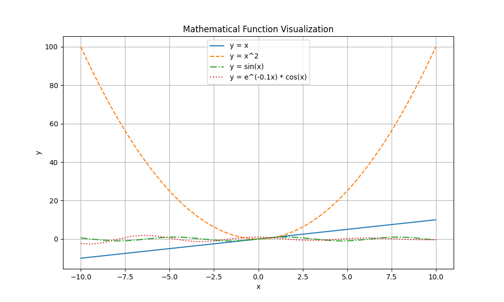
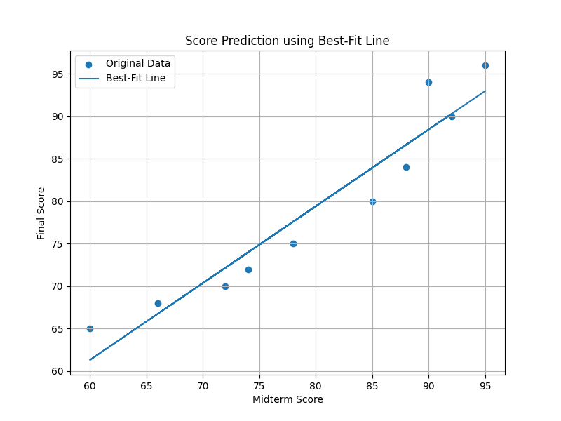

# math-visualization-assignment
# Math Visualization Assignment

## Project Description
This project demonstrates mathematical function visualization and student score data analysis using Python, NumPy, and Matplotlib.

## Libraries Used
- NumPy
- Matplotlib

## How to Run
1. Install required libraries:
   pip install numpy matplotlib

2. Run the Python file:
   python math_visualization.py

## Generated Graphs
- function_plot.png
- own_equation.png
- score_scatter.png
- score_histogram.png
- score_bar_chart.png
- score_prediction.png

## Screenshots

## Explanation

### How does visualization help us understand mathematical functions and data?
Visualization helps us identify patterns, relationships, and trends more easily.

### Which plot was most useful and why?
The prediction graph was most useful because it showed the relationship between midterm and final scores clearly.

### What is the role of NumPy and Matplotlib?
NumPy is used for mathematical calculations and arrays. Matplotlib is used to create graphs and visualizations.
